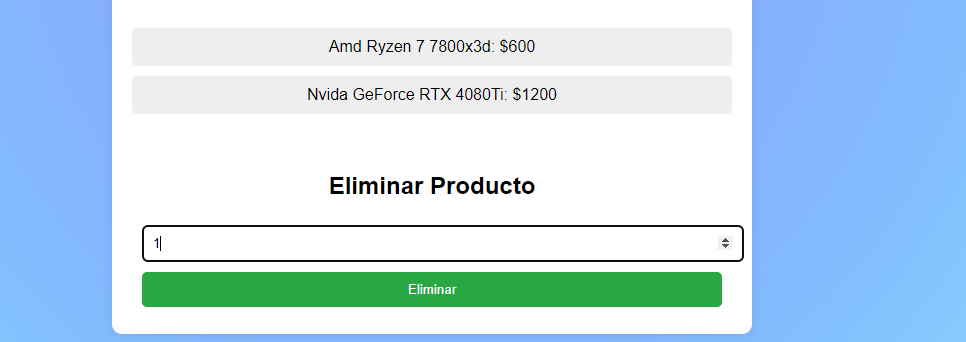

<h1>Proyecto Final: Segunda entrega. Alumno: Lautaro Cruz</h1>
    <h2>Proyecto realizado con:</h2>
    

    <li>
        node.js
    </li>
    <li>
        Express
    </li>
    <li>
        FileSystem
    </li>
    <li>
        Postman
    </li>
    <li>
        Handlebars
    </li>
    <li>
        Socket.io
    </li>
    <li>
        Sweetalert2
    </li>
    <li>
        handlebars-layouts
    </li>    
    <li>
        Git
    </li>
    

    

    <h2>Método de instalación:</h2>
    <li>(en consola o utilizando git bash) git clone https://github.com/LautaroCruz1/proyectoCoder-1.git</li>
    <li>cd proyectoCoder-1-1</li>
    <li>npm i express express-handlebars socket.io sweetalert2</li>
    <h2>Método de ejecución:</h2>
    <li>npm init</li>
    <li>modificar dentro de package.json la sección: "start": "node --watch app.js"</li>
    <li>ejecutar npm start (en consola)</li>
    <li>el código esta ejecutado en localhost:8080</li>

    <h2>Demostración de la página en tiempo Real</h2>
    <h3>Cargamos la app</h3>
        <h4>Bienvenida</h4>
            <li>Siempre utilizaremos la misma URL:</li>
            <li>http://localhost:8080/realtimeproducts</li>
            <li>La app nos da la bienvenida y nos avisa que se ha conectado un cliente(por backend)</li>
            
            <li>Tanto el form, como products.json se encuentran vacios</li>
            
     
    <h3>Añadimos un producto mediante el formulario</h3>
        <li>En éste caso publicaremos un procesador de la linea AMD</li>
        
        <li>Clickeamos "agregar"</li>
    <h3>Visualizamos el producto añadido en tiempo real</h3>
        
        <li>Podemos observar que el producto fue añadido al listado</li>
        <li>Ahora añadimos otro producto para completar el listado, en éste caso una placa gráfica</li>
        
        <li>Observamos que el producto también fue añadido al listado</li>
        
    <h3>Eliminamos los productos listados</h3>
        <li>Ahora eliminaremos los productos dentro del listado en tiempo real</li>
        <li>Para ello escribiremos el id del producto a eliminar, en éste caso el procesador tiene ID: 1 y la placa ID: 2</li>
        
        <li>Clickeamos en eliminar</li>
        
        <li>Una vez eliminado el procesador, queda un solo producto cuyo ID es 2</li>
        

